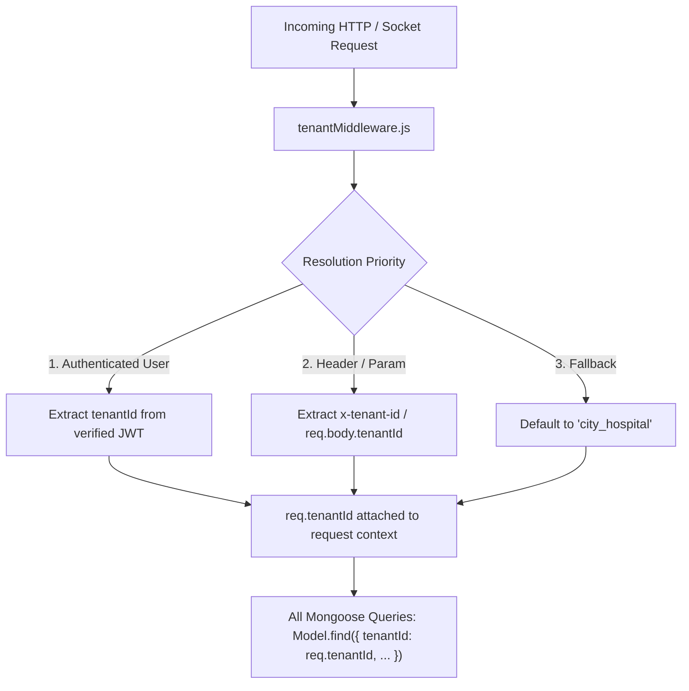
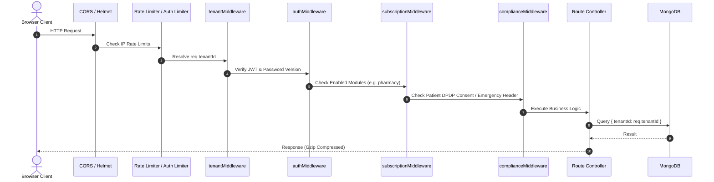
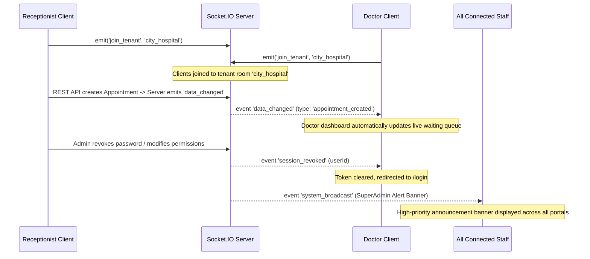
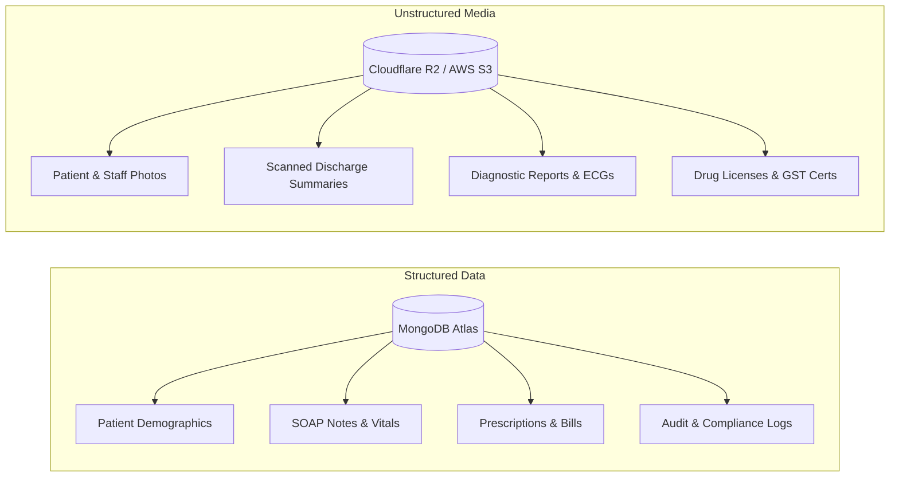
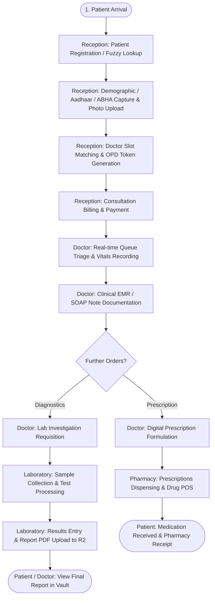

# Exhaustive Technical & Architectural Analysis: CUROXA (MediCore HIMS SaaS)

---

## 1. Executive Summary & Platform Identity

**CUROXA** (internally designated as **MediCore**) is an enterprise-grade, multi-tenant, cloud-native **Hospital Information Management System (HIMS) & Healthcare SaaS Platform**. Designed for modern clinics, multi-specialty hospitals, and hospital chains, CUROXA manages the entire patient lifecycle—from front-desk registration, OPD queue management, clinical EMR/SOAP notes, and digital prescriptions, to laboratory diagnostics, pharmacy point-of-sale (POS), procurement inventory, HR/payroll, and platform-wide Super-Admin governance.

---

## 2. System Architecture & Codebase Topology

CUROXA follows a decoupled client-server web application architecture with logical database isolation and real-time bidirectional synchronization:

```
c:\Users\lenovo\OneDrive\Desktop\CUROXA\clinical_management/
├── backend/                              # Express.js REST API & Socket.IO Engine
│   ├── config/                           # DB, Cloudflare R2/S3, Master catalog configs
│   │   ├── db.js                         # Mongoose connection pool & event handlers
│   │   ├── env.js                        # Environment variable normalization
│   │   ├── r2.js                         # S3Client initialization for Cloudflare R2 / AWS S3
│   │   └── laboratory_master.json        # Standardized diagnostic test definitions
│   ├── middleware/                       # Request lifecycle & security pipeline
│   │   ├── authMiddleware.js             # JWT verification, RBAC, password versioning
│   │   ├── tenantMiddleware.js           # Multi-tenant context resolver (req.tenantId)
│   │   ├── complianceMiddleware.js       # DPDP Act 2023 consent validation & audit trails
│   │   └── subscriptionMiddleware.js     # SaaS module gating & feature flag checks
│   ├── models/                           # 44 Mongoose schemas
│   ├── routes/                           # 23 REST controller modules
│   └── server.js                         # Express setup, Helmet, Rate-limiting, Socket.IO hub
├── frontend/                             # React 18 SPA (Vite + Tailwind CSS v4)
│   ├── src/
│   │   ├── components/                   # Reusable components & rich editors
│   │   │   ├── ClinicalRichEditor.jsx    # Formatted clinical note editor with toolbar
│   │   │   ├── SearchableDropdown.jsx    # Fuzzy-search select component for medicines/ICD
│   │   │   ├── WakeUpOverlay.jsx         # Cold-start loading indicator for server wakeups
│   │   │   ├── GlobalSupportWidget.jsx   # Live platform helpdesk widget
│   │   │   └── PermissionGate.jsx        # Component-level RBAC wrapper
│   │   ├── pages/                        # 14 Role dashboards and auth pages
│   │   ├── utils/                        # Axios instance with interceptors, socket client
│   │   ├── App.jsx                       # Top-level router, theme listener, socket hub
│   │   └── main.jsx                      # DOM mount & strict mode
│   ├── vite.config.js                    # Vite bundler configuration
│   └── package.json                      # Frontend dependency manifest
└── docs/
    ├── saas_costing_and_storage_details.md # SaaS unit economics and hosting models
    └── PROJECT_ANALYSIS_SUMMARY.md        # Comprehensive system analysis
```

---

## 3. Multi-Tenancy & Data Isolation Model

CUROXA enforces **Logical Multi-Tenancy** using a shared database cluster with tenant discrimination:



* **Tenant Resolution**: Handled globally in `tenantMiddleware.js`.
* **Compound Database Indexing**: Key collections index `{ tenantId: 1, ... }` to guarantee query isolation and sub-millisecond execution over high data volumes.
* **Module Feature Gating**: `subscriptionMiddleware.js` blocks access to disabled modules (e.g., `laboratory`, `pharmacy`, `inventory`) if not subscribed in the hospital's tier.

---

## 4. Complete Database Data Models (44 Mongoose Schemas)

The database layer comprises 44 domain models organized across 5 core clusters:

### A. Core Clinical & EMR Models
1. **`User.js`**: Multi-tenant staff accounts. Stores encrypted passwords, role (`admin`, `doctor`, `receptionist`, `lab`, `pharmacy`, `hr`), consultation fees, slot limits, bank details, leave balances, carried-forward leaves, weekly offs, and uploaded KYC documents.
2. **`Patient.js`**: Patient profiles with exact age breakdown (years, months, days), ABHA ID/ABDM address, Aadhaar status, medical history, allergies, emergency contacts, insurance policies, legal holds, and retention policies.
3. **`Appointment.js`**: Patient-Doctor appointments with lifecycle states (`Pending`, `Pending Approval`, `Approved`, `In Progress`, `Completed`, `Cancelled`, `Paid`, `Confirmed`), queue source (`Walk-In`, `Online`), reason, and billing tokens.
4. **`Prescription.js`**: Structured prescriptions with medications (generic/brand name, dosage, frequency, morning/noon/night timing, meal relation, duration), diagnosis, ICD-10 codes, advice, follow-up date, and digital doctor signature.
5. **`ClinicalNote.js`**: SOAP documentation (Subjective symptoms, Objective examination, Assessment, Treatment Plan) with rich-text formatting.
6. **`Vital.js`**: Historical vitals tracking (Systolic/Diastolic BP, Pulse rate, SpO2, Temperature, Respiratory Rate, Height, Weight, BMI, Blood Glucose).
7. **`ClinicalDocument.js`**: Scanned patient document metadata linked to S3/R2 storage (category, title, file URL, uploader).
8. **`ClinicalService.js`**: Master catalog of hospital procedures, bed charges, and clinical service rates.
9. **`Procedure.js`**: Record of minor/major medical procedures performed on patients.
10. **`Visit.js`**: Aggregate record of individual patient hospital visits.

### B. Diagnostic & Laboratory Models
11. **`LabTest.js`**: Catalog of diagnostic tests (Haematology, Biochemistry, Radiology, etc.) with standard normal ranges, units, specimen requirements, and pricing.
12. **`LabRequest.js`**: Diagnostic test orders requested by doctors or reception, status progression (`Requested`, `Sample Collected`, `Processing`, `Completed`), test results, doctor remarks, and final PDF report URLs.
13. **`LabInventory.js`**: Reagents, test kits, and lab consumable stocks with expiration warnings.

### C. Pharmacy & Supply Chain Models
14. **`Medicine.js`**: Drug formulary containing brand/generic names, batch numbers, manufacturer, expiry dates, purchase/sale price, stock quantities, and rack coordinates.
15. **`PharmacyTicket.js`**: Prescriptions queued for dispensing at the pharmacy counter with dispensing logs.
16. **`Vendor.js`**: Supplier directory, drug license numbers, GSTIN, bank info, and delivery rating.
17. **`PurchaseOrder.js`**: Procurement orders to vendors with item lines, unit rates, tax calculations, and approval status (`Draft`, `Approved`, `Dispatched`, `Received`).
18. **`GoodsReceipt.js`**: GRN tracking received items against POs, batch number allocation, damaged goods logging, and automatic stock updates.
19. **`Indent.js`**: Departmental stock requisitions (e.g. ICU, Lab, Wards requesting supplies from central store).
20. **`ReturnLog.js`**: Returns to vendors or pharmacy patient returns with reason and refund audit.
21. **`Asset.js`**: Hospital physical assets, medical machinery, maintenance schedules, and depreciation.

### D. Billing, HR & Governance Models
22. **`Billing.js`**: Invoices for consultations, medicines, procedures, and tests. Tracks subtotal, discount, tax, payment modes (Cash, Card, UPI, Insurance), and transaction IDs.
23. **`DiscountSetting.js`**: Pre-approved discount codes, maximum allowed percentage, and authorization criteria.
24. **`Approval.js`**: Asynchronous approval workflows (e.g. receptionist requesting a billing discount >10%, requiring admin authorization).
25. **`AttendanceRecord.js`**: Biometric check-in/out timestamps, overtime, working hours, and shift compliance.
26. **`LeaveRequest.js`**: Leave applications (Sick, Casual, Annual, Maternity, Comp-off), approval state, and balance deductions.
27. **`RoleCoverage.js`**: Temporary delegation matrix granting substitute staff permissions during primary staff leave.
28. **`Consent.js`**: DPDP Act 2023 consent ledger (purpose limitation: Treatment, Research, Marketing, status: Active/Revoked, emergency overrides).
29. **`AuditLog.js`**: Tamper-evident HIPAA/DPDP access logs (Actor, Role, Action, Patient ID, IP Address, User Agent, Metadata).
30. **`RegistrationOtp.js`**: Time-based OTP cache for patient mobile/email authentication.

### E. Super-Admin & Platform SaaS Governance Models
31. **`SuperAdminHospital.js`**: Tenant registry (Hospital name, code, plan tier, GST verification details, drug license status, health score, suspension history, enabled modules, resource limits for doctors/staff/storage, custom prescription letterhead settings).
32. **`SuperAdminOnboarding.js`**: 9-step wizard state machine tracking new hospital onboarding (Verification -> Localization -> Legal/Compliance -> Licensing -> User Provisioning -> ERP Config -> Data Migration -> Validation -> Go Live).
33. **`SuperAdminPlan.js`**: Global SaaS tier definitions, pricing, limits, and module flags.
34. **`SuperAdminInvoice.js`**: B2B SaaS subscription invoices billed to client hospitals.
35. **`SuperAdminLead.js`**: Inbound sales leads and clinic demo requests.
36. **`SuperAdminSupport.js`**: Helpdesk support tickets raised by hospital admins.
37. **`SuperAdminBroadcast.js`**: System-wide emergency banners and maintenance announcements pushed to all active dashboards.
38. **`SuperAdminEmployee.js`**: SaaS internal team directory and access permissions.
39. **`SuperAdminMeeting.js`**: Scheduled customer onboarding meetings and demos.
40. **`SuperAdminSchedule.js`**: Platform maintenance and release calendar.
41. **`SuperAdminBackup.js`**: Database snapshots and automated S3/R2 backup verification logs.
42. **`SuperAdminAudit.js`**: Audit trails of platform configuration changes.
43. **`SuperAdminReport.js`**: Aggregated platform business intelligence reports.
44. **`SuperAdminNotification.js`**: In-app notifications for Super Admin staff.

---

## 5. Backend REST API Route Controllers

The backend exposes 23 dedicated route controllers mounted on the `/api` namespace:

| Route File | Base Endpoint | Guard Middleware | Core Capabilities |
| :--- | :--- | :--- | :--- |
| `authRoutes.js` | `/api/auth` | Rate Limiter | Login, password reset, OTP verification, Google OAuth, session token validation, ping/health |
| `superAdminRoutes.js` | `/api/superadmin` | `verifyToken`, `superadmin` role | Tenant onboarding wizard, plan tier management, global analytics, broadcasts, support tickets |
| `adminRoutes.js` | `/api/admin` | `verifyToken`, `admin` role | User creation, role assignments, doctor fee settings, audit inspection, department management |
| `patientRoutes.js` | `/api/patients` | `checkModule(['reception', 'doctor'])` | Patient registration, fuzzy lookup, ABHA integration, photo upload, emergency contact update |
| `appointmentRoutes.js` | `/api/appointments` | `checkModule(['reception', 'doctor'])` | Slot allocation, appointment booking, rescheduling, approval workflows, status lifecycle |
| `emrRoutes.js` | `/api/emr` | `checkModule('doctor')`, `checkPatientConsent` | Vitals recording, SOAP clinical notes, ICD-10 suggestions, medical history, emergency bypass |
| `prescriptionRoutes.js` | `/api/prescriptions` | `checkModule('doctor')` | Create digital prescriptions, drug dosage calculation, template printing, patient history search |
| `billingRoutes.js` | `/api/billing` | `checkModule('reception')` | OPD/IPD invoicing, tax calculation, discount requests, payment ledger, receipt rendering |
| `labRoutes.js` | `/api/labs` | `checkModule('laboratory')` | Diagnostic requisition queue, test results entry, normal range comparison, PDF report upload |
| `labTestRoutes.js` | `/api/lab-tests` | `checkModule('laboratory')` | Master diagnostic test directory maintenance, test pricing, specimen guides |
| `labInventoryRoutes.js` | `/api/lab-inventory` | `checkModule('laboratory')` | Reagent stock monitoring, expiry tracking, test kit replenishment |
| `medicineRoutes.js` | `/api/medicines` | `checkModule(['pharmacy', 'doctor'])` | Pharmacy drug catalog, batch tracking, stock replenishment, price management |
| `pharmacyTicketRoutes.js` | `/api/pharmacy-tickets` | `checkModule('pharmacy')` | Real-time prescription dispensing queue, fulfillment status, dispensing audit |
| `vendorRoutes.js` | `/api/vendors` | `checkModule('inventory')` | Vendor directory, GST verification, procurement ratings, contact cards |
| `purchaseOrderRoutes.js` | `/api/purchase-orders` | `checkModule('inventory')` | Purchase order authoring, approval routing, vendor dispatch logging |
| `goodsReceiptRoutes.js` | `/api/goods-receipts` | `checkModule('inventory')` | Goods Receipt Notes (GRN), invoice matching, batch creation, inventory sync |
| `indentRoutes.js` | `/api/indents` | `checkModule('inventory')` | Internal department supply requisitions, fulfillment tracking |
| `returnRoutes.js` | `/api/returns` | `checkModule('inventory')` | Supplier return logs, pharmacy credit notes, damaged stock disposal |
| `hrRoutes.js` | `/api/hr` | `verifyToken` | Shift scheduling, attendance logging, leave approvals, salary computation, payslip exports |
| `clinicalServiceRoutes.js` | `/api/clinical-services` | `verifyToken` | Hospital service charges, procedure fee catalog, nursing care rates |
| `approvals.js` | `/api/approvals` | `verifyToken` | Asynchronous discount/action approvals between reception and administration |
| `auditLogs.js` | `/api/audit-logs` | `verifyToken`, `admin` | Searchable security audit trails, IP logs, emergency bypass reviews |
| `permissions.js` | `/api/permissions` | `verifyToken` | Role delegation matrix and dynamic coverage permission resolution |

---

## 6. Security, Middleware & Request Pipeline



1. **Stateful Exponential Brute-Force Rate Limiter**:
   * Tracks consecutive authentication failures per IP in an in-memory map.
   * After 5 failures: 30-second lockout -> 60-second lockout on repeat -> 5-minute lockout on subsequent cycles.
2. **Session Revocation & Password Versioning**:
   * Changing a password increments `password_version` in the database.
   * `authMiddleware` compares the token's embedded version against the live DB record. If mismatched, the session is instantly revoked and a WebSocket event (`session_revoked`) forces immediate logout on all active client devices.
3. **NoSQL Injection & Header Hardening**:
   * `express-mongo-sanitize` strips `$` and `.` operators from request payloads.
   * `helmet` configures HTTP security headers.
   * Response payloads use `compression` (Gzip) for bandwidth optimization.

---

## 7. Frontend Dashboards & Component Deep-Dive

The frontend client is implemented with React 18, utilizing React Router v6, Tailwind CSS v4, Lucide Icons, and Framer Motion animations.

### Functional Breakdown of All 9 Dedicated Role Portals:

#### 1. Doctor Dashboard (`DoctorDashboard.jsx` — 635 KB)
* **Real-time Patient Queue**: View today's OPD waiting queue, token numbers, and triage vitals.
* **Clinical Consultation Suite**: Record Chief Complaints, History of Present Illness (HPI), Physical Examination, and Provisional Diagnosis.
* **Rich EMR Editor**: Integrated with `ClinicalRichEditor.jsx` for formatted clinical notes.
* **Digital Prescription Maker**: Dedicated tab (`PrescriptionMakerTab.jsx`) with drug search, frequency matrix, auto-calculated dosages, and printable prescription templates.
* **Lab Ordering**: Order investigations directly into the laboratory queue with one click.
* **DPDP Emergency Bypass**: Modal allowing doctors to unlock restricted medical histories in emergency scenarios with mandatory clinical justification logging.

#### 2. Receptionist Dashboard (`ReceptionistDashboard.jsx` — 730 KB)
* **Patient Registration Engine**: Multi-tab form capturing exact Age (Years, Months, Days breakdown), gender, contact, Aadhaar, ABHA ID, and emergency contact.
* **Live Webcam / Avatar Capture**: Direct webcam photo capture and Cloudflare R2 / S3 file upload integration.
* **Appointment Scheduling & Queue Board**: Doctor slot matching, walk-in vs. online token allocation, and appointment approvals.
* **Point-of-Sale Billing**: Generate OPD/IPD invoices, add clinical service items, apply discount codes, initiate approval requests, and print receipts.

#### 3. Super Admin Dashboard (`SuperAdminDashboard.jsx` — 722 KB)
* **9-Step Hospital Onboarding Wizard**: Guided multi-step onboarding pipeline with verification checklists (PAN/GST verification, drug license validation, ERP domain configuration, DB initialization).
* **Multi-Tenant Operations**: Monitor live hospital health scores, manage subscription tiers, toggle active modules, and adjust seat/storage quotas.
* **Real-Time Broadcast Center**: Broadcast system-wide notification banners across all tenant portals.
* **Global Support & Invoicing**: Track B2B SaaS revenue, hospital support tickets, and system backups.

#### 4. Hospital Admin Dashboard (`AdminDashboard.jsx` — 810 KB)
* **Staff Provisioning**: Create and manage doctor, receptionist, lab, pharmacy, and HR user accounts.
* **Dynamic Doctor Fees & Slots**: Set consultation charges, follow-up fee rules, and max patient caps per day.
* **Delegation & Coverage Engine**: Assign substitute staff coverage during leaves (`curoxa_pmState`).
* **Discount Approvals**: Real-time approval/rejection of billing discount requests from receptionists.
* **Audit & Security Center**: Review access logs and verify compliance.

#### 5. Patient Portal (`PatientDashboard.jsx` — 327 KB)
* **Authentication**: Passwordless OTP login (`PatientPortalLogin.jsx`) sent to registered phone/email, or password credentials.
* **Online Appointment Booking & Token Tracker**: Book OPD consultations, select preferred doctors, and view real-time queue position and approval state.
* **Digital Health Record Vault**: View and download past prescriptions, lab test reports (PDFs), and diagnostic summaries.
* **Invoices & Receipts**: View financial transaction history, outstanding balances, and print payment receipts.
* **DPDP Act 2023 Consent Center**: Patient-facing privacy settings to grant, restrict, or revoke access permissions for Treatment, Medical Research, and Hospital Communication.

#### 6. Laboratory Diagnostics Dashboard (`LabDashboard.jsx` — 239 KB)
* **Requisition Worklist**: Real-time queue of diagnostic test orders from doctors and reception.
* **Sample Collection & Processing Lifecycle**: Multi-step status tracking (`Requested` -> `Sample Collected` -> `Processing` -> `Completed`).
* **Results Entry & Normal Range Highlighting**: Enter quantitative and qualitative test values with automatic flagging of out-of-range parameters based on `laboratory_master.json`.
* **Report Generation & Cloud Upload**: Upload diagnostic PDFs, ECG scans, and imaging reports to Cloudflare R2 / S3 with instant publishing to doctor and patient portals.
* **Reagent & Lab Consumables**: Track reagent stock levels, test kit usage, and batch expiration dates.

#### 7. Pharmacy & Point of Sale (`PharmacyDashboard.jsx` — 425 KB)
* **Prescription Dispensing Queue**: Instant display of incoming doctor prescriptions with drug list, dosages, and instructions.
* **Drug Master Catalog**: Comprehensive medicine directory with brand names, generic formulations, manufacturers, batch numbers, and rack locations.
* **Inventory Control & Expiry Tracking**: Real-time stock counts, low-stock threshold alerts, and batch expiration management.
* **Pharmacy POS & Billing**: Dispense medications, calculate GST taxes, generate itemized pharmacy bills, handle cash/digital payments, and log returns.

#### 8. Procurement & Central Supply Chain (`ProcurementDashboard.jsx` — 295 KB)
* **Vendor Directory**: Manage registered suppliers, drug license records, tax identification (GSTIN), and delivery ratings.
* **Departmental Indent Approvals**: Process stock requisition requests from Pharmacy, Laboratory, and In-patient wards.
* **Purchase Order (PO) Management**: Create multi-item purchase orders with tax and discount computations, route for managerial approval, and dispatch to vendors.
* **Goods Receipt Note (GRN)**: Inspect delivered shipments, match items and prices against purchase orders, record received batch numbers and expiry dates, and update central inventory.
* **Stock Returns & Credit Notes**: Log damaged or expired goods returned to vendors.

#### 9. HR, Staff & Payroll Management (`HRPayroll.jsx` — 92 KB & `HRPayrollStaff.jsx` — 286 KB)
* **Employee Directory**: Full staff profiles, designations, department assignments, shift allocations, reporting managers, and uploaded KYC/contract files.
* **Attendance & Time Tracking**: Daily biometric check-ins, working hours computation, overtime tracking, and shift compliance.
* **Leave Management**: Leave application system (Sick, Casual, Annual, Maternity, Paternity, Comp-Off, Loss of Pay), multi-level approval workflows, and automated balance deductions.
* **Salary Structure & Automated Payroll**: Configure salary components (Basic, HRA, Special Allowance, PF, ESI, TDS deductions) and generate monthly pay slips with PDF export.

---

## 8. Real-Time WebSocket Architecture

The platform uses `Socket.IO` (`backend/server.js` & `frontend/src/utils/socket.js`) to keep all connected staff dashboards synchronized without manual refreshes:



### Core Socket Events:
1. `join_tenant`: Clients join isolated tenant rooms (normalized to lowercase `tenantId`), ensuring data broadcasts never cross hospital boundaries.
2. `data_changed`: Emitted upon database state mutations (appointments, billing, patient records, lab requests). Listened to by `App.jsx` and dispatched via window events (`curoxa_sync`).
3. `session_revoked`: Instant termination of sessions across all active browser tabs when a user's password or authorization changes.
4. `system_broadcast`: Real-time system announcements pushed by the Super Admin to all active tenant sessions.
5. `global_theme_changed`: Live theme synchronization across client terminals.

---

## 9. Storage Architecture & Cloud Integrations

CUROXA implements a **Hybrid Storage Model** separating structured database data from large binary assets:



* **Storage Client** (`backend/config/r2.js`): Configured using `@aws-sdk/client-s3`. Supports **Cloudflare R2** with automatic fallback to AWS S3.
* **Zero-Egress Cost Model**: R2 eliminates outbound data transfer charges, providing predictable hosting costs for high-volume scanned medical records and diagnostics.
* **File Upload Pipeline**: `multer` intercepts incoming multipart uploads, passes buffers to the S3/R2 client, and stores generated public/pre-signed URLs in the corresponding Mongoose records.

---

## 10. End-to-End Clinical & Operational Workflow



---

## 11. SaaS Business Model & Unit Economics

*(Reference: `docs/saas_costing_and_storage_details.md`)*

### Subscription Tiers & Resource Limits:
| Tier | Monthly Price | Annual Price | Doctor Limit | Staff Limit | Storage Quota | Modules Included |
| :--- | :--- | :--- | :--- | :--- | :--- | :--- |
| **Standard Basic** | ₹5,000 / mo | ₹48,000 / yr | 10 | 20 | 50 GB | Reception, Doctor, DPDP Compliance |
| **Professional** | ₹24,000 / mo | ₹230,400 / yr | 50 | 100 | 250 GB | Basic + Pharmacy, Laboratory |
| **Enterprise Elite**| ₹50,000 / mo | ₹480,000 / yr | Custom / Uncapped | Custom / Uncapped | 500 GB – 1 TB+ | All Modules + Procurement, Advanced BI |

### Infrastructure Cost & Margin Analysis:
* **Storage Cost per Patient/Year**: ~**₹0.74 ($0.009)** (assuming 4.5 MB average scanned document footprint on Cloudflare R2).
* **Incremental Staff Account Cost**: ~**₹0.00** (pure JSON database records).
* **Host Cost for a Mid-Sized Hospital (10,000 patients / 60 GB data)**:
  * Cloudflare R2 Storage (60 GB): ₹75 / month
  * MongoDB Cluster Allocation: ₹150 / month
  * Compute / API Server Allocation: ₹200 / month
  * **Total Hosting Cost**: **₹425 / month**
* **Revenue from Professional Plan**: **₹24,000 / month**
* **Gross Profit Margin**: **>98%**

---

## 12. Security, Compliance & Regulatory Safeguards

1. **Digital Personal Data Protection Act (DPDP) 2023 Compliance**:
   * Patient consent tracking with explicit purpose limitation (Treatment, Research, Commercial).
   * Emergency consent override mechanism (`x-bypass-consent-emergency`) for life-threatening situations with permanent audit logging.
   * Legal hold and data retention expiry mechanisms on patient profiles.
2. **HIPAA-Style Audit Logs** (`AuditLog.js`):
   * Every access to sensitive EMR records records actor ID, user role, patient ID, IP address, user agent, action timestamp, and modification metadata.
3. **Defense-in-Depth Network Security**:
   * Progressive brute-force authentication protection.
   * NoSQL injection sanitization via `express-mongo-sanitize`.
   * Secure HTTP headers with `helmet`.
   * Secure credential storage with `bcrypt` salt rounds.

---

## 13. Comprehensive Project Assessment

| Area | Status | Evaluation |
| :--- | :--- | :--- |
| **Architecture** | Excellent | Clean separation of concerns, modular route handlers, scalable multi-tenancy, and real-time event pipeline. |
| **Feature Completeness** | Comprehensive | Covers the complete hospital operational spectrum (Admin, EMR, OPD, Lab, Pharmacy, Inventory, HR, Super-Admin). |
| **Security & Privacy** | Advanced | Implements DPDP Act 2023 consent validation, role-based access control, session revocation, and immutable audit logs. |
| **Scalability** | Cloud-Ready | Multi-tenant schema design with indexed query paths and zero-egress cloud object storage ensures predictable performance and margins at scale. |
